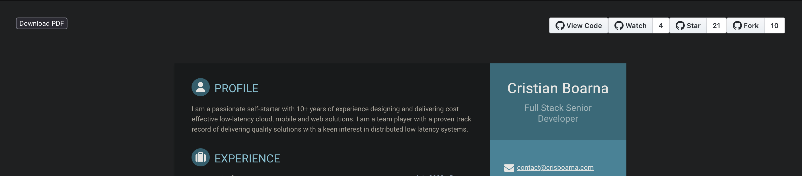
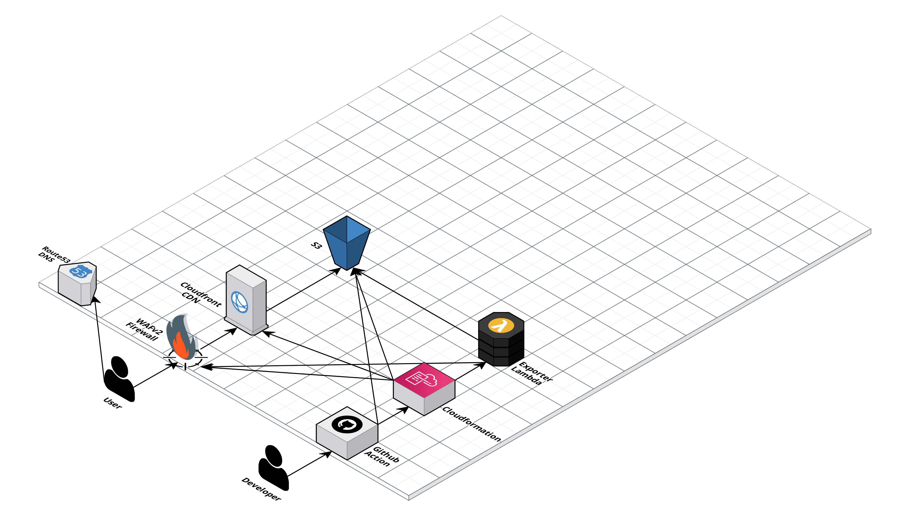
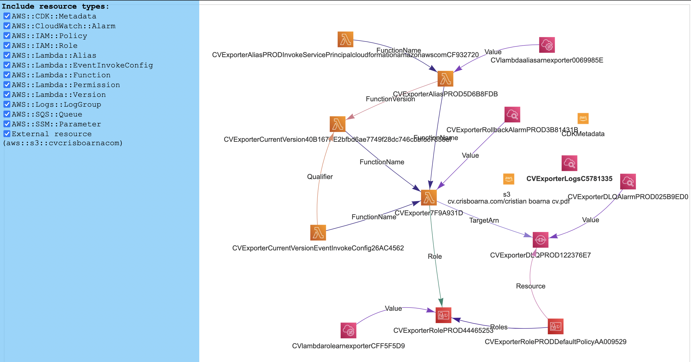
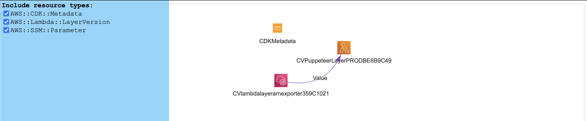
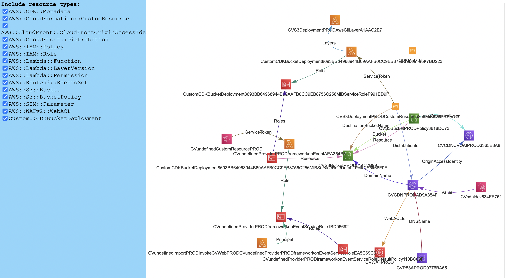

<div align="center">
<h1>Boarna Cristian CV</h1>
<h2>
  <a href="https://github.com/crisboarna/react-cv/actions/workflows/merge_main.yaml">
    
  </a>
  <a href="https://snyk.io/test/github/crisboarna/react-cv">
    
  </a>
  <a href="https://codecov.io/gh/crisboarna/react-cv">
    
  </a>
  <a href="https://github.com/crisboarna/react-cv">
    
  </a>
  <a href="https://github.com/crisboarna/react-cv/issues">
    
  </a>
  <a href="https://opensource.org/licenses/MIT">
    
  </a>
  <a href="https://github.com/semantic-release/semantic-release">
    
  </a>
  <a href="https://commitizen.github.io/cz-cli/">
    
  </a>
    
  <a href="https://github.com/crisboarna">
    
  </a>
  <a href="https://github.com/crisboarna/react-cv/pulls">
    
  </a>
  
  <h2>
    <a  href="https://cv.crisboarna.com">
      Live Demo
    </a>
  </h2>
</h2>
</div>

## Table of Contents

* [How It Works](#how-it-works)
* [Development](#development)
  * [Installation](#installation)
  * [Running](#running)
  * [Building](#building)
  * [Linting](#linting)
  * [Testing](#testing)
* [Infrastructure](#infrastructure)
  * [Architectural Diagram](#architectural-diagram)
  * [Cloudformation Resource Diagrams](#cloudformation-resource-diagrams)
  * [Deployment from local](#deployment-from-local)
* [How To Contribute](#how-to-contribute)
* [License](#license)

# How It Works
The CV is written as a ReactJS website which is accessible at [cv.crisboarna.com](https://cv.crisboarna.com) and has a `Download` button to save a pdf of the CV.

**Short behind the scenes**

Website is hosted on `S3` accessed onl by `Cloudfront` CDN via `OIA`. You can view the [architectural diagram](#architectural-diagram) at the bottom of the page. 

`Lambda` runs a custom runtime Docker container based on Lambda NodeJS AL3 environment. This is done to ensure local and remote environments are identical.
This container runs a headless Chrome browser via `Puppeteer` which loads the CV live page at [https://cv.crisboarna.com](https://cv.crisboarna.com), uses Chrome inbuilt PDF printing feature to generate the PDF.

This has the added benefit of 
1. Ensuring the PDF has selectable text that is extractable
2. Has a standard rendering viewport that is not reliant on client

During the CDK `Web` stack deployment, the above Lambda is called and via `Cloudformation` `Custom Resource` and places in S3 the generated PDF to be available on-demand for download to reduce download latency and reduce costs, having to invoke the Lambda only once.

# Development
**Languages and tools used**
0. Docker
1. Typescript
2. AWS CDK
3. ReactJS
4. Webpack
5. Nx Monorepo

You can use `nx docker:run exporter` for testing locally the PDF generation to S3/local directory.

**Testing**

Jest is used for `exporter` and `web`.

Jest & AWS CDK Assertions is used for `infra`.

## Installation
```shell
yarn install
```

## Running

### Web
```shell
nx serve web
```

### Exporter
```shell
nx docker:run exporter
```

Alternatively, in the `.run` folder there are run configurations for running the `exporter` from `IntelliJ`.

## Building
Build can be triggered across all services (`exporter`,`infra`,`web`) by running
```shell
yarn build
```

Alternatively each can be run individually via one of the commands
```shell
nx build exporter
nx build infra
nx build web
```

## Linting
Linting can be triggered across all services (`exporter`,`infra`,`web`) by running
```shell
yarn lint
```

Alternatively each can be run individually via one of the commands
```shell
nx lint exporter
nx lint infra
nx lint web
```

*Note* 

Infrastructure CDK code is linted with `eslint` and `cdk-nag`, the CDK equivalent of Cloudformation `cfn_nag` to ensure standard & best practice adherence by IaC.

Other apps are linted with `eslint`.

## Testing
Tests can be run across all services (`exporter`,`infra`,`web`) by running
```shell
yarn test
```

Alternatively each can be run individually via one of the commands
```shell
nx test exporter
nx test infra
nx test web
```

Testing coverage is enforced globally via the individual `jest.config.js` as follows

**Exporter**

| Category   | Minimum |
|------------|---------|
| Branches   | 100%    |
| Functions  | 100%    |
| Lines      | 100%    |
| Statements | 100%    |

**Infrastructure**

| Category   | Minimum |
|------------|---------|
| Branches   | 100%     |
| Functions  | 100%     |
| Lines      | 100%     |
| Statements | 100%     |

**Web**

| Category   | Minimum |
|------------|---------|
| Branches   | 76%     |
| Functions  | 82%     |
| Lines      | 87%     |
| Statements | 87%     |


# Infrastructure
## Architectural Diagram


## Deployment from local
Single command
```shell
nx deploy infra
```

Individual components in order
*Note* Deployment order is important as subsequent stacks have dependencies on previous ones.

```shell
cdk deploy -a 'npx ts-node --prefer-ts-exts -P apps/infra/tsconfig.app.json -r tsconfig-paths/register -r dotenv/config apps/infra/src/bin/ECR.ts'
cdk deploy -a 'npx ts-node --prefer-ts-exts -P apps/infra/tsconfig.app.json -r tsconfig-paths/register -r dotenv/config apps/infra/src/bin/Exporter.ts'
cdk deploy -a 'npx ts-node --prefer-ts-exts -P apps/infra/tsconfig.app.json -r tsconfig-paths/register -r dotenv/config apps/infra/src/bin/Web.ts'
```

or simpler, with build included
```shell
nx deploy:ecr infra
nx deploy:exporter infra
nx deploy:web infra
```

## Cloudformation Resource Diagrams
These are the diagrams of all resources and their connections as generated by `cfn-diagram` from the CDK source code.

To generate the diagram on the fly while tweaking the infrastructure run
```shell
nx diagram exporter
nx diagram layer
nx diagram web
```





# How to Contribute

1. Clone repo and create a new branch: 
```shell
git checkout https://github.com/crisboarna/react-cv -b name_for_new_branch`.
````
2. Make changes and test
3. Submit Pull Request with comprehensive description of changes

## License
[](https://creativecommons.org/publicdomain/zero/1.0/)

Full license details can be found in [LICENSE.md](./LICENSE.md)
